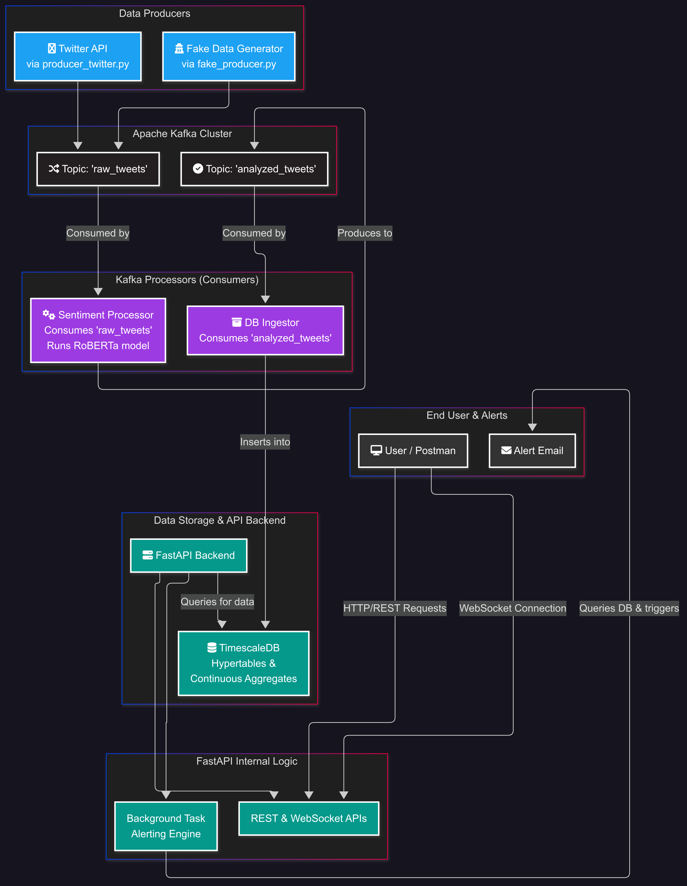

# StreamPulse – Real-Time Twitter Sentiment Analyzer

[](https://www.python.org/)
[](https://fastapi.tiangolo.com/)
[](https://kafka.apache.org/)
[](https://huggingface.co/)
[](https://www.timescale.com/)
[](https://www.docker.com/)
[](https://support.google.com/mail/answer/7126229?hl=en)

**StreamPulse** is a real-time data pipeline that tracks sentiment on live tweets using Apache Kafka, Hugging Face Transformers, and TimescaleDB. It allows users to analyze public opinion about any keyword (e.g., "Tesla", "Mission Impossible") using REST APIs or WebSocket streams.

---

## 🔍 Features

- ⏱️ **Real-Time Pipeline**: Ingest tweets via Twitter API or a fallback mock generator
- 📊 **Sentiment Analysis**: Run Transformer-based classification (`positive`, `negative`, `neutral`)
- 📥 **Kafka Integration**: Fully decoupled producer/consumer architecture
- 🧠 **Storage**: Store enriched tweets in TimescaleDB hypertables
- 📈 **Aggregation**: Create continuous aggregates using time buckets (1 min)
- ⚡ **REST + WebSocket APIs**: Access real-time trends and streams
- 📧 **Alerting Engine**: Email alerts for sudden sentiment shifts
- 🧪 **Postman-Ready**: All endpoints testable via Postman
- 🐳 **Dockerized**: All services can run in isolated Docker containers

---

## 🧱 System Architecture



---

## 🧰 Tech Stack

| Layer            | Technologies                                                                 |
|------------------|------------------------------------------------------------------------------|
| **Backend**       | FastAPI, Uvicorn, Pydantic, asyncio                                          |
| **Streaming**     | Apache Kafka, Zookeeper, kafka-python                                        |
| **NLP / ML**      | Hugging Face Transformers, `cardiffnlp/twitter-roberta-base-sentiment-latest` |
| **Database**      | TimescaleDB (PostgreSQL + Hypertable + Continuous Aggregates)               |
| **Data Ingestion**| Tweepy (Twitter v2 API), Fake Producer fallback                             |
| **Dev Tools**     | Docker, Docker Compose, dotenv, Postman, loguru                             |
| **Alerting**      | Gmail SMTP (`smtplib`) + Background Tasks (`asyncio.create_task`)           |
| **Real-time APIs**| REST (`/tweets`, `/summary`, `/sentiment-trend`) + WebSocket (`/ws/...`)    |


---

## 📁 Project Structure

```
StreamPulse/
├── backend/
│   ├── main.py
│   ├── alerts.py
│   ├── logger.py
│   ├── db.py, models.py, email_utils.py
│   ├── api/
│   │   ├── tweets.py, websocket.py
│   ├── Dockerfile, .env, requirements.txt
│
├── kafka-producer/
│   ├── producer_twitter.py
│   ├── fake_producer.py
│   └── .env
│
├── kafka-processor/
│   ├── processor_sentiment.py
│   └── db_ingestor.py
│
├── Kafka + Zookeeper/
│   └── docker-compose.yml
│
├── db/
│   └── init.sql
```

---

## ⚙️ Local Setup Instructions

### ✅ Prerequisites

- Docker & Docker Compose
- Python 3.10+
- Twitter Developer Account (or use `fake_producer.py`)

---

### 🔧 Step-by-Step Guide

#### 1️⃣ Clone the Repo

```bash
git clone https://github.com/SumanKumar5/StreamPulse.git
cd StreamPulse
```

#### 2️⃣ Start Kafka, Zookeeper & TimescaleDB

```bash
docker compose up -d
```

#### 3️⃣ Setup Database

```bash
docker cp db/init.sql timescaledb:/init.sql
docker exec -it timescaledb psql -U postgres -d sentiment_db -f /init.sql
```

#### 4️⃣ Start Kafka Producers

```bash
cd kafka-producer
python producer_twitter.py   # switches to fake_producer on rate-limit
```

#### 5️⃣ Start Sentiment Processor

```bash
cd kafka-processor
python processor_sentiment.py
```

#### 6️⃣ Start DB Ingestor

```bash
cd kafka-processor
python db_ingestor.py
```

#### 7️⃣ Start API Backend

```bash
cd backend
uvicorn main:app --reload
```

---

## 📮 API Endpoints (Test on Postman)

| Method | Route                        | Description                        |
|--------|------------------------------|------------------------------------|
| GET    | `/tweets/latest`            | Get recent tweets (paginated)      |
| GET    | `/sentiment-trend`          | Minute-wise average sentiment      |
| GET    | `/summary`                  | Overall sentiment stats            |
| GET    | `/sentiment/counts?keyword=`| Keyword-based Pos/Neg/Neu count    |
| WS     | `/ws/tweets`                | Live tweets stream                 |
| WS     | `/ws/sentiment`             | Live sentiment updates             |

---

## 📬 Alerting System

-  Runs in background task via `main.py`
-  Sends email when `avg_score` drops below threshold
-  SMTP support via Gmail (configurable in `.env`)

---

## 📌 Notes

- Twitter limits may apply — fallback to fake producer for demos
- All services run independently — restartable at any point
- You can test everything without deploying — fully Postman compatible

---

## 📃 License

[MIT License](./LICENSE) 

---

## 🙌 Author

Made with ❤️ by [Suman Kumar](https://github.com/SumanKumar5)